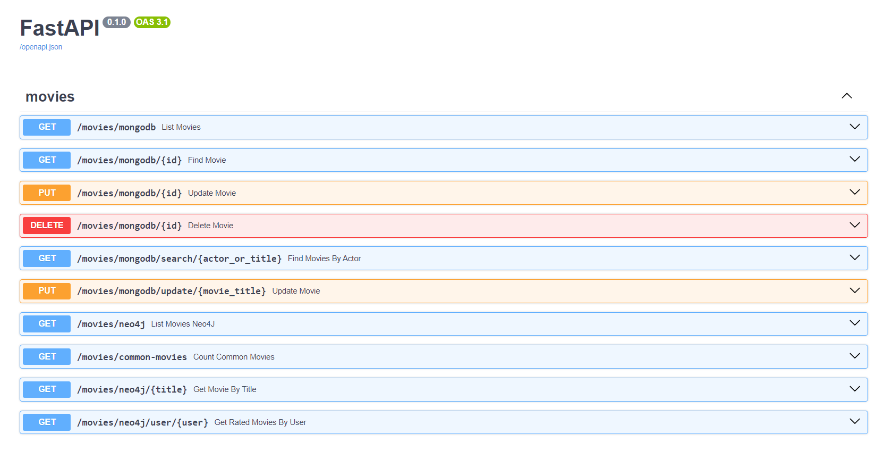

# nosql-mongodb-neo4j

Voici le dépôt Git pour le TP sur les bases de données NoSQL de Sacha THUAULT, Léo PEIRO et Arthur FRANCOIS.

Avant de lancer l'API, veuillez renseigner vos identifiants de connexion aux bases de données MongoDB via Atlas et Neo4J dans le fichier main.py aux lignes 11, 12 et 14.

Pour lancer l'API, rendez-vous dans le répertoire movies/pymongo-fastapi-crud :
```
cd .\movies\pymongo-fastapi-crud\  
```
Puis saisissez les commandes suivantes dans le terminal associé à ce dossier : 

```
python -m venv env-pymongo-fastapi-crud
pip install -r requirements.txt
python -m uvicorn main:app --reload
```


Une fois ces commandes effectuées, rendez-vous dans le lien proposé dans votre invite de commande :
```
INFO:     Uvicorn running on http://127.0.0.1:8000 (Press CTRL+C to quit)
```
Dans l'url, ajoutez /docs et profitez de l'interface pour tester les différentes requêtes mises en place :



Vous pouvez alors effectuer des requêtes sur l'API selon vos besoins.
Les routes disponibles sont répertoriées dans le fichier routes.py. 
L'ensemble des routes demandées a été configuré, 
et nous avons développé quelques routes supplémentaires que nous jugeons intéressantes.

Pour les requêtes de modification de film, veuillez vous référer au dossier json 
fourni dans le dépôt GitHub pour que le format soit correct.